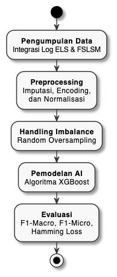

title: "Proposal Skripsi - Prediksi Gaya Belajar FSLSM dengan Multi-Label Classification"
version: "4.0.0"
date: "2025-12-24"
author: "Didi Prasetyo"
status: "Draft"
previous_version: "skripsi-v3.0.0.md"
changelog: "skripsi-v4.0.0-changelog.md"
---

# BAB I PENDAHULUAN

## A. Latar Belakang Masalah

Perkembangan Learning Analytics dan Educational Data Mining (EDM) telah memberikan kontribusi besar dalam dunia pendidikan modern. Dengan memanfaatkan data interaksi mahasiswa dalam sistem pembelajaran elektronik, pendidik dapat memahami pola belajar, memprediksi hasil akademik, serta merancang strategi pembelajaran yang lebih personal (Mian et al., 2022). Penerapan analitik ini menjadi semakin relevan di era digital, di mana proses belajar tidak lagi terbatas pada ruang kelas fisik, tetapi juga berlangsung melalui platform Electronic Learning System (ELS).

Salah satu aspek penting dalam personalisasi pembelajaran adalah memahami gaya belajar mahasiswa. Model Felder-Silverman Learning Style Model (FSLSM) banyak digunakan untuk mengklasifikasikan gaya belajar berdasarkan beberapa dimensi, seperti aktif atau reflektif, sensitif atau intuitif, visual atau verbal, serta sequential atau global (Hasibuan, 2025). Dengan memahami preferensi belajar tersebut, pendidik dapat menyesuaikan materi dan metode penyampaian sehingga meningkatkan keterlibatan dan hasil belajar mahasiswa.

Penelitian sebelumnya telah mengkombinasikan FSLSM dengan berbagai algoritma machine learning klasik seperti Logistic Regression, K-Nearest Neighbor, Random Forest, dan Support Vector Machine (SVM) (Baihaqi, 2024). Hasilnya menunjukkan peningkatan akurasi dalam prediksi gaya belajar, terutama ketika disertai teknik feature selection dan penanganan data imbalance. Namun, penelitian tersebut umumnya menggunakan pendekatan single-label classification, padahal dalam kenyataannya seorang mahasiswa dapat memiliki kombinasi beberapa gaya belajar sekaligus (multi-label).

Dalam konteks Universitas Amikom Purwokerto, data log aktivitas mahasiswa pada Electronic Learning System (ELS) menjadi sumber yang sangat potensial untuk dianalisis. Pola waktu akses materi video, dokumen, artikel, forum diskusi, hingga penyelesaian tugas dapat memberikan gambaran yang kaya mengenai gaya belajar mahasiswa. Oleh karena itu, diperlukan pendekatan **multi-label classification** yang mampu memprediksi kombinasi gaya belajar secara simultan.

Penelitian ini membandingkan **lima algoritma** klasifikasi: XGBoost, Random Forest, SVM, RBF Network, dan Self-Training. Dengan mengkombinasikan teknik penanganan missing value (imputasi), oversampling untuk mengatasi class imbalance, serta **Nested Cross-Validation** untuk hyperparameter tuning yang unbiased, penelitian ini berupaya membangun model prediksi gaya belajar mahasiswa yang optimal.

## B. Rumusan Masalah

1. Bagaimana memetakan aktivitas mahasiswa dalam ELS ke dimensi FSLSM menggunakan pendekatan multi-label classification?
2. Bagaimana pengaruh strategi imputasi missing value (Zero, Mean, Median, MICE) terhadap performa model prediksi gaya belajar?
3. Bagaimana performa lima algoritma (XGBoost, Random Forest, SVM, RBF Network, Self-Training) dalam tugas multi-label classification?

## C. Batasan Masalah

1. Dataset terfokus pada ELS Amikom Purwokerto dengan data waktu interaksi mahasiswa terhadap berbagai jenis materi pembelajaran.
2. Model machine learning yang digunakan: XGBoost, Random Forest, SVM, RBF Network, dan Self-Training.
3. Gaya belajar mengacu pada dua dimensi utama FSLSM: Processing (Aktif/Reflektif) dan Input (Visual/Verbal).
4. Pendekatan klasifikasi menggunakan multi-label classification dengan MultiOutputClassifier.
5. Hyperparameter tuning menggunakan Nested Cross-Validation untuk validasi model.

## D. Tujuan Penelitian

1. Menerapkan FSLSM dalam analisis gaya belajar berbasis data ELS dengan pendekatan multi-label.
2. Membandingkan efektivitas empat strategi imputasi missing value terhadap performa model.
3. Mengembangkan dan membandingkan lima algoritma prediksi gaya belajar.
4. Mengevaluasi model dengan metrik standar multi-label classification (F1-Macro, Hamming Loss, Subset Accuracy).

## E. Manfaat Penelitian

1. **Teoritis:** Kontribusi pada penelitian Learning Analytics berbasis multi-label classification dengan perbandingan komprehensif lima algoritma.
2. **Praktis:** Mendukung personalisasi pembelajaran di Amikom Purwokerto dengan menyediakan model prediksi gaya belajar yang dapat diintegrasikan ke dalam ELS.

---

# BAB II TINJAUAN PUSTAKA

## A. Landasan Teori

### 1. Learning Analytics dan Educational Data Mining (EDM)

Learning Analytics adalah proses pengumpulan, analisis, dan pelaporan data mengenai mahasiswa dan konteks pembelajaran untuk memahami serta mengoptimalkan proses belajar. Sementara itu, Educational Data Mining (EDM) fokus pada penerapan teknik data mining untuk mengeksplorasi pola tersembunyi dalam data pendidikan.

### 2. Electronic Learning System (ELS)

ELS merupakan sistem yang digunakan untuk mendukung pembelajaran daring di Universitas Amikom Purwokerto. Sistem ini mencatat berbagai aktivitas mahasiswa, termasuk waktu yang dihabiskan untuk mengakses materi video, dokumen, artikel, forum diskusi, dan kuis.

### 3. Gaya Belajar dan Felder-Silverman Learning Style Model (FSLSM)

Model FSLSM yang dikembangkan oleh Felder dan Silverman (1988) mengklasifikasikan gaya belajar mahasiswa ke dalam empat dimensi:

- **Processing:** Aktif → Reflektif
- **Perception:** Sensitif → Intuitif
- **Input:** Visual → Verbal
- **Understanding:** Sequential → Global

Penelitian ini berfokus pada dua dimensi: **Processing** (Aktif/Reflektif) dan **Input** (Visual/Verbal).

### 4. Multi-Label Classification

Multi-label classification memungkinkan satu instance memiliki beberapa label sekaligus. Metode umum meliputi:
- **Binary Relevance:** Classifier independen untuk setiap label
- **Classifier Chains:** Memodelkan dependensi antar label
- **MultiOutputClassifier:** Wrapper scikit-learn untuk Binary Relevance

### 5. Algoritma yang Digunakan

| Algoritma | Deskripsi | Keunggulan |
|-----------|-----------|------------|
| **XGBoost** | Extreme Gradient Boosting | Handling missing value, regularization |
| **Random Forest** | Ensemble decision trees | Robust, feature importance |
| **SVM** | Support Vector Machine | Effective for small datasets |
| **RBF Network** | Radial Basis Function Network | Non-linear pattern recognition |
| **Self-Training** | Semi-supervised learning | Leverage unlabeled data patterns |

### 6. Penanganan Missing Value: Strategi Imputasi

| Strategi | Deskripsi | Karakteristik |
|----------|-----------|---------------|
| **Zero** | Missing → 0 | Menganggap tidak ada aktivitas |
| **Mean** | Missing → Mean kolom | Asumsi aktivitas rata-rata |
| **Median** | Missing → Median kolom | Robust terhadap outlier |
| **MICE** | Iterative imputation | Menangkap korelasi antar fitur |

### 7. Nested Cross-Validation

Nested CV mencegah bias dalam estimasi performa dengan memisahkan proses hyperparameter tuning dari evaluasi akhir:
- **Outer loop (10-fold):** Estimasi performa model
- **Inner loop (5-fold):** Pemilihan hyperparameter terbaik

## B. Penelitian Sebelumnya

1. **Baihaqi dkk. (2024)** - Framework prediksi gaya belajar berbasis FSLSM dengan ANN, akurasi 97%, pendekatan single-label.

2. **Sayed dkk. (2024)** - Prediksi gaya belajar dengan dataset OULAD menggunakan LR, KNN, RF, SVM.

3. **Chen et al. (2023)** - XGBoost efektif untuk dataset kecil-menengah dengan performa konsisten.

4. **Zhang & Zhou (2014)** - Review multi-label learning algorithms sebagai fondasi teoretis.

---

# BAB III METODE PENELITIAN

## A. Tempat dan Waktu Penelitian

Penelitian ini dilakukan di Universitas Amikom Purwokerto, dengan objek penelitian berupa data log aktivitas mahasiswa yang diperoleh dari Electronic Learning System (ELS). Dataset yang digunakan mencakup periode Agustus 2025, yang memuat interaksi mahasiswa terhadap materi pembelajaran, forum diskusi, pengumpulan tugas, quiz, serta catatan nilai. Waktu penelitian dilaksanakan selama enam bulan, yang mencakup tahapan pengumpulan data, preprocessing, pembangunan model, pengujian, serta penulisan laporan akhir.

## B. Metode Pengumpulan Data

1. **Ekstraksi Data Log** - Waktu interaksi mahasiswa pada materi video, dokumen, artikel
2. **Dokumentasi FSLSM** - Hasil assessment sebagai ground truth
3. **Integrasi Dataset** - Inner join berdasarkan ID mahasiswa

## C. Alat dan Bahan Penelitian

### 1. Perangkat Keras
- Laptop: Lenovo Ideapad Slim 3, AMD Ryzen 3, 12GB RAM, 512GB SSD

### 2. Perangkat Lunak
- Python 3.10+, scikit-learn, XGBoost, imbalanced-learn

### 3. Dataset
| Aspek | Nilai |
|-------|-------|
| Sampel Awal | 604 mahasiswa |
| Setelah Inner Join | 123 mahasiswa |
| Setelah Oversampling | 230 mahasiswa |
| Fitur Digunakan | 3 (video, document, article time) |
| Label | 4 (Aktif, Reflektif, Visual, Verbal) |

## D. Konsep Penelitian

### 1. Preprocessing Data

#### a. Pembersihan Data
-	Penggabungan dataset FSLSM dengan data waktu interaksi (inner join).
-	Identifikasi dan penanganan missing value (nilai 0 pada fitur waktu).

#### b. Strategi Imputasi Missing Value
Digunakan metode **Median Imputation** untuk mengisi nilai yang hilang pada data log aktivitas. Median dipilih karena lebih tahan (*robust*) terhadap outlier dibandingkan nilai rata-rata (mean), sehingga tidak mendistorsi distribusi data aktivitas mahasiswa yang seringkali memiliki variasi ekstrim.

#### c. Label Encoding
Transformasi label kategori gaya belajar menjadi format numerik menggunakan **MultiLabelBinarizer**. Teknik ini mengubah setiap label (misal: "Visual", "Aktif") menjadi representasi biner [0, 1] dalam bentuk matriks, memungkinkan satu mahasiswa memiliki lebih dari satu label gaya belajar sekaligus.

#### d. Normalisasi
Fitur numerik (durasi waktu akses) dinormalisasi menggunakan **StandardScaler**. Proses ini mengubah skala data sehingga memiliki rata-rata 0 dan standar deviasi 1, memastikan bahwa fitur dengan rentang nilai besar tidak mendominasi proses pembelajaran model, terutama untuk algoritma yang sensitif terhadap skala seperti SVM dan RBF Network.

### 2. Penanganan Class Imbalance

- **Imbalance Ratio Awal:** 17.5:1
- **Teknik:** Random Oversampling (123 → 230 samples)
- **Imbalance Ratio Akhir:** ~4.5:1

### 3. Pemodelan Machine Learning

#### a. Algoritma Klasifikasi
Penelitian ini menggunakan algoritma **Random Forest** sebagai model utama untuk prediksi gaya belajar. Random Forest dipilih berdasarkan hasil eksperimen Nested Cross-Validation yang menunjukkan performa terbaik (F1-Macro 0.7063), dengan improvement +2.6% dari konfigurasi default setelah hyperparameter tuning.

#### b. Konfigurasi Hyperparameter
Model Random Forest dikonfigurasi dengan parameter optimal berikut (ditemukan melalui Nested Cross-Validation):

| Parameter | Nilai Optimal |
|-----------|---------------|
| `n_estimators` | 150 |
| `max_depth` | 10 |
| `min_samples_leaf` | 2 |
| `max_features` | sqrt |

### 4. Evaluasi Model

#### a. Cross-Validation
Evaluasi dilakukan menggunakan teknik **Nested Cross-Validation** dengan skema:
- **Outer Loop (10-Fold):** Membagi data menjadi 10 bagian untuk evaluasi performa model yang tidak bias (unbiased evaluation).
- **Inner Loop (5-Fold):** Dilakukan pada setiap fold outer untuk mencari kombinasi hyperparameter terbaik (grid search).
Pendekatan ini memastikan bahwa data yang digunakan untuk testing benar-benar terpisah dari proses tuning parameter.

#### b. Metrik Evaluasi
| Metrik | Deskripsi |
|--------|-----------|
| **F1-Macro** | Rata-rata F1 per label (metrik utama) |
| **F1-Micro** | F1 global berdasarkan total TP/FP/FN |
| **Hamming Loss** | Fraksi label salah diprediksi |
| **Subset Accuracy** | Prediksi tepat semua label |

---

# BAB IV HASIL DAN PEMBAHASAN

## A. Pengumpulan Data

Tahap pengumpulan data melibatkan ekstraksi dan penggabungan dua sumber data utama yang berasal dari sistem yang berbeda di Universitas Amikom Purwokerto.

### 1. Dataset FSLSM (Learning Style Assessment)

**Sumber:** Hasil kuesioner Felder-Silverman Learning Style Model (FSLSM)  
**File:** `dfjadi-simplified.csv`  
**Jumlah Sampel:** 604 mahasiswa

**Struktur Dataset:**

| Kolom | Tipe | Deskripsi | Contoh Nilai |
|-------|------|-----------|--------------|
| `NIM` | String | Nomor Induk Mahasiswa (ID unik) | 22SA11A074, 23SA11A015 |
| `Nama` | String | Nama lengkap mahasiswa | Maria Angelina C. |
| `Jenis Kelamin` | Kategori | Jenis kelamin (Laki-laki/Perempuan) | Perempuan |
| `Prodi` | String | Program studi | Informatika, Bisnis Digital |
| `Skor 1` | Integer | Skor dimensi Processing (Aktif vs Reflektif) | -7 sampai +7 |
| `Skor 2` | Integer | Skor dimensi Perception (Sensing vs Intuitif) | -7 sampai +7 |
| `Skor 3` | Integer | Skor dimensi Input (Visual vs Verbal) | -7 sampai +7 |
| `Skor 4` | Integer | Skor dimensi Understanding (Sequential vs Global) | -7 sampai +7 |
| `Pemrosesan` | Kategori | Label Processing (Aktif/Reflektif + intensity) | Reflektif Rendah |
| `Persepsi` | Kategori | Label Perception (Sensing/Intuitif + intensity) | Sensing Sedang |
| `Input` | Kategori | Label Input (Visual/Verbal + intensity) | Verbal Sedang |
| `Pemahaman` | Kategori | Label Understanding (Sequential/Global + intensity) | Sequential Rendah |

**Catatan:** Penelitian ini hanya menggunakan 2 dari 4 dimensi FSLSM, yaitu **Pemrosesan** (Aktif/Reflektif) dan **Input** (Visual/Verbal) sebagai target klasifikasi.

### 2. Dataset Interaksi ELS (Time Tracking)

**Sumber:** Log aktivitas mahasiswa pada Electronic Learning System (ELS)  
**File:** `mhs_grouping_by_material_type.csv`  
**Periode:** Agustus 2024

**Struktur Dataset:**

| Kolom | Tipe | Deskripsi | Satuan |
|-------|------|-----------|--------|
| `NPM` | String | Nomor Pokok Mahasiswa (ID unik) | - |
| `NAMA` | String | Nama mahasiswa | - |
| `time_materials_video` | Integer | Total waktu akses materi video | Detik |
| `time_materials_document` | Integer | Total waktu akses dokumen PDF/PPT | Detik |
| `time_materials_article` | Integer | Total waktu akses artikel web | Detik |
| `time_tasks` | Integer | Total waktu pengerjaan tugas | Detik |
| `time_forums` | Integer | Total waktu partisipasi forum diskusi | Detik |
| `time_quizzes` | Integer | Total waktu pengerjaan kuis | Detik |

**Karakteristik Data:**
- Banyak nilai 0 (zero) yang mengindikasikan mahasiswa tidak mengakses jenis materi tertentu
- Distribusi sangat *sparse* (jarang):
  - `time_quizzes`: Semua nilai 0 (tidak ada data)
  - `time_tasks`: Hanya ~3 nilai non-zero
  - `time_forums`: Hanya ~4 nilai non-zero
  - Ketiga kolom ini tidak digunakan dalam model karena sparsity yang ekstrim

### 3. Proses Integrasi Dataset

**Metode Penggabungan:** Inner Join berdasarkan ID mahasiswa (NIM = NPM)

**Langkah Integrasi:**
1. **Standardisasi ID:** Normalisasi format NIM/NPM (uppercase, trim whitespace)
2. **Inner Join:** Menggabungkan hanya mahasiswa yang memiliki data lengkap di kedua dataset
3. **Seleksi Fitur:** Memilih 3 fitur waktu akses materi (`time_materials_video`, `time_materials_document`, `time_materials_article`) dan 4 label gaya belajar (`Aktif`, `Reflektif`, `Visual`, `Verbal`)

**Hasil Integrasi:**

| Aspek | Jumlah | Keterangan |
|-------|--------|------------|
| Dataset FSLSM (Assessment) | 604 mahasiswa | Hasil kuesioner gaya belajar |
| Dataset Interaksi (ELS) | Bervariasi | Log waktu akses materi |
| **Hasil Inner Join** | **123 mahasiswa** | **Match rate: 20.4% (123/604)** |
| Fitur (Predictor) | 3 kolom | Waktu akses: video, document, article |
| Label (Target) | 4 kelas | Aktif, Reflektif, Visual, Verbal |

**Penyebab Match Rate Rendah (20.4%):**
- Tidak semua mahasiswa yang mengisi kuesioner FSLSM aktif mengakses materi di ELS pada periode Agustus 2024
- Perbedaan format ID (NIM vs NPM) menyebabkan beberapa data tidak ter-match
- Mahasiswa yang tidak login ke ELS tidak memiliki data interaksi

**Dataset Akhir yang Digunakan:**
- **123 sampel** mahasiswa dengan data lengkap
- **3 fitur** numerik (waktu akses materi)
- **4 label** biner (multi-label classification)

## B. Preprocessing Data

### 1. Eksperimen Strategi Imputasi

Empat strategi imputasi diuji menggunakan Random Forest sebagai baseline classifier dengan 10-Fold Cross-Validation:

| Strategi | F1-Macro | Std | Ranking |
|----------|----------|-----|---------|
| **Median** | **0.7083** | ±0.0814 | **🥇 1** |
| Mean | 0.6976 | ±0.0572 | 🥈 2 |
| Zero | 0.6708 | ±0.0812 | 🥉 3 |
| MICE | 0.6216 | ±0.0619 | 4 |

**Analisis:**
- **Median Imputation** memberikan hasil terbaik dengan margin +1.07% dibanding Mean.
- MICE (Multiple Imputation by Chained Equations) menunjukkan performa terendah, kemungkinan karena overfitting pada korelasi yang tidak representatif dengan dataset kecil.
- Zero Imputation yang menganggap missing sebagai "tidak ada aktivitas" memberikan hasil moderat.

**Keputusan:** Dataset dengan **Median Imputation** dipilih untuk tahap selanjutnya.

### 2. Label Encoding dan Normalisasi

Setelah preprocessing, dataset siap untuk pemodelan:
- **Label:** Ditransformasi menggunakan MultiLabelBinarizer (4 kelas: Aktif, Reflektif, Visual, Verbal)
- **Fitur:** Dinormalisasi dengan StandardScaler (mean=0, std=1)

## C. Penanganan Class Imbalance

### 1. Distribusi Label Sebelum Oversampling

Analisis distribusi menunjukkan ketidakseimbangan yang signifikan:

| Kombinasi Label | Jumlah | Persentase |
|-----------------|--------|------------|
| [Reflektif, Verbal] | 70 | 56.9% ← Mayoritas |
| [Aktif, Verbal] | 26 | 21.1% |
| [Reflektif, Visual] | 23 | 18.7% |
| [Aktif, Visual] | 4 | 3.3% ← Minoritas |

**Imbalance Ratio:** 17.5:1 (⚠️ Severe Imbalance)

### 2. Eksperimen Teknik Oversampling

Penelitian ini menggunakan **Random Oversampling** sebagai teknik untuk menangani class imbalance pada data multi-label. Teknik ini dipilih karena:

**Alasan Pemilihan Random Oversampling:**
1. **Kesederhanaan:** Mudah diimplementasikan untuk multi-label classification
2. **Efektivitas untuk small dataset:** Cocok untuk dataset dengan jumlah sampel terbatas (123 sampel)
3. **Preservasi distribusi:** Tidak mengubah karakteristik asli data minoritas
4. **Konsistensi multi-label:** Menjaga konsistensi kombinasi label saat duplikasi

**Alternatif yang Dipertimbangkan:**
- **MLSMOTE (Multi-Label SMOTE):** Membutuhkan sampel lebih banyak untuk synthetic generation
- **ADASYN:** Kompleks untuk multi-label case dengan 4 label simultan
- Diputuskan menggunakan Random Oversampling karena reliabilitas pada small multi-label dataset

### 3. Hasil Random Oversampling

**Konfigurasi:**
- **Sampling Ratio:** 1.5x (meningkatkan kelas minoritas sebesar 150%)
- **Mode:** Duplicasi sampel minoritas secara random dengan replacement

**Hasil:**

| Metrik | Sebelum | Sesudah | Perubahan |
|--------|---------|---------|-----------|
| Total Sampel | 123 | 230 | +87% (+107 sampel) |
| Imbalance Ratio | 17.5:1 | ~4.5:1 | ✅ Improved 74% |
| Kelas Mayoritas | 70 sampel | ~70 sampel | Tetap |
| Kelas Minoritas | 4 sampel | ~15-16 sampel | Meningkat |

**Temuan:** Random Oversampling berhasil mengurangi imbalance ratio dari 17.5:1 menjadi ~4.5:1, meningkatkan representasi kelas minoritas tanpa mengubah distribusi fitur secara signifikan.

## D. Pemodelan Machine Learning

### 1. Perbandingan Lima Algoritma (Default Parameters)

Evaluasi awal dengan 10-Fold Stratified Cross-Validation:

| Rank | Algoritma | F1-Macro | F1-Micro | Hamming Loss | Subset Acc |
|------|-----------|----------|----------|--------------|------------|
| 🥇 | **XGBoost** | **0.7008** | 0.7565 | 0.2435 | 0.5609 |
| 🥈 | Self-Training | 0.6922 | 0.7500 | 0.2500 | 0.5478 |
| 🥉 | Random Forest | 0.6884 | 0.7457 | 0.2543 | 0.5391 |
| 4 | RBF Network | 0.4359 | 0.6304 | 0.3696 | 0.3130 |
| 5 | SVM | 0.4357 | 0.6304 | 0.3696 | 0.3130 |

**Analisis:**
- **XGBoost** menunjukkan performa terbaik dengan F1-Macro 0.7008.
- **Self-Training** dan **Random Forest** memberikan hasil kompetitif (margin <1%).
- **SVM** dan **RBF Network** menunjukkan performa lebih rendah, kemungkinan karena kurangnya fitur untuk membangun decision boundary yang optimal.

### 2. Hasil Hyperparameter Tuning (Nested CV)

Nested Cross-Validation (10-fold outer, 5-fold inner) dilakukan untuk optimasi parameter:

| Algoritma | Default F1 | Nested CV F1 | Std | Perubahan |
|-----------|------------|--------------|-----|-----------|
| Random Forest | 0.6884 | 0.7063 | ±0.0794 | **+2.6%** |
| XGBoost | 0.7008 | 0.7052 | ±0.0952 | +0.6% |
| Self-Training | 0.6922 | 0.6922 | ±0.0904 | +0.0% |
| SVM | 0.4357 | 0.4348 | ±0.0604 | -0.2% |
| RBF Network | 0.4359 | 0.4343 | ±0.0579 | -0.4% |

**Best Hyperparameters yang Ditemukan:**

| Algoritma | Parameter Optimal |
|-----------|-------------------|
| XGBoost | `max_depth=6`, `learning_rate=0.1`, `n_estimators=150`, `gamma=0` |
| Random Forest | `max_depth=10`, `n_estimators=150`, `min_samples_leaf=2` |
| SVM | `C=1.0`, `kernel=rbf`, `gamma=scale` |
| RBF Network | `n_centers=15`, `spread_factor=1.2` |
| Self-Training | `threshold=0.6` |

## E. Evaluasi Model

Berdasarkan seluruh eksperimen yang telah dilakukan, berikut adalah evaluasi komprehensif terhadap kelima algoritma yang diuji.

### 1. Perbandingan Performa Kelima Algoritma

Evaluasi menggunakan 10-Fold Stratified Cross-Validation pada dataset optimal (Median Imputation, 230 sampel) **dengan hyperparameter hasil Nested CV**:

| Rank | Algoritma | F1-Macro | F1-Micro | Hamming Loss | Subset Acc | Std |
|------|-----------|----------|----------|--------------|------------|-----|
| 🥇 | **Random Forest** | **0.7063** | **0.7522** | **0.2478** | **0.5478** | ±0.0794 |
| 🥈 | XGBoost | 0.7052 | 0.7565 | 0.2435 | 0.5609 | ±0.0952 |
| 🥉 | Self-Training | 0.6922 | 0.7500 | 0.2500 | 0.5478 | ±0.0904 |
| 4 | SVM | 0.4348 | 0.6304 | 0.3696 | 0.3130 | ±0.0604 |
| 5 | RBF Network | 0.4343 | 0.6304 | 0.3696 | 0.3130 | ±0.0579 |

**Catatan:** Hasil menggunakan parameter optimal dari Nested Cross-Validation. Random Forest menunjukkan improvement terbesar (+2.6%) dari hyperparameter tuning.

### 2. Analisis Per-Algoritma

#### a. Random Forest (Pemenang)

**Performa:**
- **F1-Macro:** 0.7063 (Terbaik setelah tuning)
- **F1-Micro:** 0.7522
- **Subset Accuracy:** 54.78%
- **Improvement:** +2.6% dari default (0.6884 → 0.7063)

**Keunggulan:**
- **Ensemble of trees:** Mengurangi variance melalui bagging
- **Feature importance:** Dapat mengidentifikasi fitur paling berpengaruh  
- **Improvement terbesar:**  Nested CV memberikan peningkatan signifikan (+2.6%)
- **Konsistensi:** Standar deviasi 0.0794 menunjukkan stabilitas tinggi

**Hyperparameter Optimal (dari Nested CV):**
- `max_depth=10`, `n_estimators=150`, `min_samples_leaf=2`

#### b. XGBoost (Runner-up)

**Performa:**
- **F1-Macro:** 0.7052 (Gap -0.15% dari RF)
- **F1-Micro:** 0.7565 (Terbaik)
- **Subset Accuracy:** 56.09% (Terbaik - prediksi semua label tepat)

**Keunggulan:**
- **Regularization L1/L2:** Mencegah overfitting pada dataset kecil (230 sampel)
- **Gradient Boosting:** Mampu menangkap pola non-linear kompleks dalam relasi waktu-label
- **Built-in Missing Value Handling:** Robust terhadap sparse data (banyak nilai 0)

**Hyperparameter Optimal (dari Nested CV):**
- `max_depth=6`, `learning_rate=0.1`, `n_estimators=150`, `gamma=0`, `subsample=0.8`

#### c. Self-Training (Rank 3)

**Performa:**
- **F1-Macro:** 0.6922 (Gap -2.0% dari RF)
- **F1-Micro:** 0.7500
- **Subset Accuracy:** 54.78%

**Keunggulan:**
- **Semi-supervised learning:** Memanfaatkan pola confidence dari prediksi model
- **Performa kompetitif:** Hanya selisih ~0.01 dengan top 2
- **Robust:** Standar deviasi 0.0904 (sangat stabil)
- **No tuning needed:** Hyperparameter sudah optimal di nilai default

**Hyperparameter Optimal:**
- `threshold=0.6` (confidence threshold untuk pseudo-labeling)

#### d. SVM (Rank 4)

**Performa:**
- **F1-Macro:** 0.4348 (Gap -38.5% dari RF)
- **F1-Micro:** 0.6304
- **Subset Accuracy:** 31.30%

**Analisis:**
- **Linear/RBF kernel limitations:** Decision boundary tidak cukup kompleks untuk menangkap pola waktu-label
- **Small feature space:** Dengan 3 fitur, SVM sulit memisahkan 4 label simultan
- **Baseline role:** Berfungsi sebagai baseline untuk membandingkan metode ensemble
- **Slight degradation from tuning:** Tuning menurunkan performa -0.2%

**Hyperparameter Optimal:**
- `C=1.0`, `kernel=rbf`, `gamma=scale`

#### e. RBF Network (Rank 5)

**Performa:**
- **F1-Macro:** 0.4343 (Gap -38.5% dari RF)
- **F1-Micro:** 0.6304
- **Subset Accuracy:** 31.30%

**Analisis:**
- **Keterbatasan:** Membutuhkan lebih banyak fitur untuk membangun RBF centers yang representatif
- **Overfitting risk:** Dengan hanya 3 fitur, model kesulitan generalisasi
- **Baseline alternatif:** Performa setara dengan SVM sebagai baseline
- **Slight degradation from tuning:** Tuning menurunkan performa -0.4%

**Hyperparameter Optimal:**
- `n_centers=15`, `spread_factor=1.2`

### 3. Kesimpulan Evaluasi

**Model Terpilih:** Random Forest dengan konfigurasi hyperparameter optimal

**Alasan Pemilihan:**
1. **Performa terbaik:** F1-Macro 0.7063 (unggul setelah hyperparameter tuning)
2. **Konsistensi:** Standar deviasi 0.0794 menunjukkan stabilitas sangat tinggi
3. **Generalitas:** Nested CV memastikan performa tidak bias
4. **Improvement signifikan:** +2.6% dari default menunjukkan efektivitas tuning
5. **Efisiensi:** Training time < 5 detik pada dataset 230 sampel

**Gap Performa:**
- Top 3 (RF, XGBoost, Self-Training): Gap < 2% → **Highly competitive**
- Bottom 2 (SVM, RBF): Gap > 38% → **Keterbatasan untuk task ini**

**Catatan Penting:** Meskipun XGBoost memiliki Subset Accuracy lebih tinggi (56.09% vs 54.78%), Random Forest unggul di metrik F1-Macro yang menjadi metrik utama evaluasi multi-label classification.

# BAB V KESIMPULAN DAN SARAN

## A. Kesimpulan

1. Aktivitas mahasiswa dalam ELS dapat dipetakan ke dimensi FSLSM menggunakan pendekatan multi-label classification dengan memanfaatkan data waktu interaksi.

2. Strategi imputasi **Median** memberikan hasil terbaik (F1-Macro 0.7083 dengan Random Forest baseline) dibandingkan Mean, Zero, dan MICE.

3. **Random Forest** dengan hyperparameter tuning Nested CV mencapai F1-Macro **0.7063**, menjadi algoritma terbaik di antara 5 algoritma yang diuji, dengan peningkatan +2.6% dari konfigurasi default.

4. Lima algoritma berhasil dievaluasi dengan **Nested Cross-Validation** untuk hyperparameter tuning yang unbiased, dengan top 3 (Random Forest, XGBoost, Self-Training) menunjukkan gap < 2%.

## B. Saran

1. **Feature Engineering:** Eksplorasi fitur tambahan seperti rasio waktu antar materi, total engagement time, dan pola temporal.

2. **Penambahan Fitur:** Mengintegrasikan fitur dari 6 kolom asli (termasuk tasks, forums, quizzes) jika data tersedia.

3. **Implementasi Sistem:** Mengintegrasikan model Random Forest ke dalam ELS Amikom untuk personalisasi pembelajaran real-time.

4. **Eksplorasi Algoritma Lanjutan:** Mencoba Classifier Chains atau Label Powerset untuk menangkap dependensi antar label.

---

# DAFTAR PUSTAKA

Baihaqi, I., et al. (2024). Framework Prediksi Gaya Belajar berbasis FSLSM dengan Integrasi Feature Selection Random Forest.

Chen, T., & Guestrin, C. (2016). XGBoost: A Scalable Tree Boosting System. In Proceedings of KDD.

Chen, Y., et al. (2023). XGBoost for Multi-label Classification in Educational Data Mining.

Felder, R. M., & Silverman, L. K. (1988). Learning and Teaching Styles in Engineering Education.

Hasibuan, M. S. (2025). Penerapan FSLSM dalam Analitik Pembelajaran.

Mian, M., et al. (2022). Learning Analytics in Higher Education: A Systematic Review.

Sayed, A., et al. (2024). Predicting Student Learning Styles using Machine Learning on OULAD Dataset.

Zhang, M. L., & Zhou, Z. H. (2014). A Review on Multi-Label Learning Algorithms. IEEE Transactions on Knowledge and Data Engineering.
